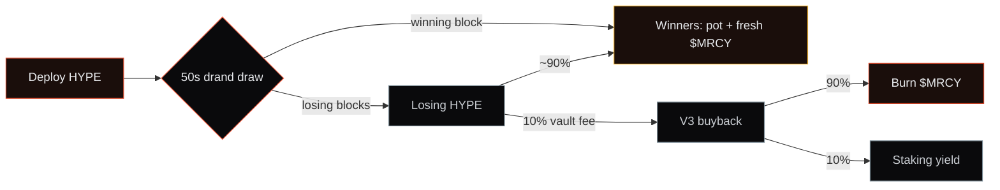
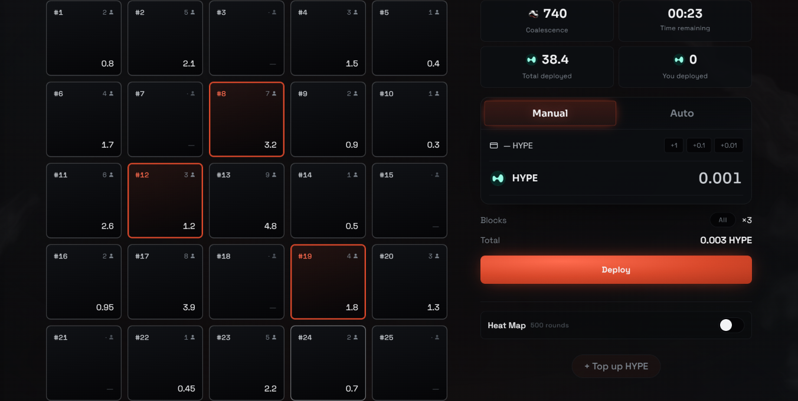

<div align="center">


# MERCURY

**On-chain mining on HyperEVM. No mercy in the deep.**

[](./LICENSE)
[](https://mrcy.supply)
[](./contracts/foundry.toml)
[](https://x.com/MRCYsupply)

Deploy HYPE on a 5×5 grid. Every **50 seconds** a winning block is drawn by
on-chain verifiable randomness. Winners take the round's HYPE pot plus freshly
mined **$MRCY** — solo if alone on the block, split pro-rata if not, with a
rare **1-in-600 Coalescence jackpot** on top.

**Play → [mrcy.supply](https://mrcy.supply)**


</div>

---

## The loop



<div align="center">

<sub><em>The collect phase: 46 seconds to position, then the board locks and the draw lands.</em></sub>
</div>

## What this repository is

The source of Mercury's **money contracts** — the ones that custody and move
value: the token and its hard cap, staking, the buyback treasury, the
liquidity lock, the affiliate registry, and the on-chain randomness verifier.
Every line here is byte-for-byte what is deployed and explorer-verified on
HyperEVM — see [Verify it yourself](#verify-it-yourself).

The **game engine** (`GridMining`, `AutoMiner`) — the grid/emission/resolution
logic that is Mercury's core design work — ships here as a **published ABI**
(`abi/`), so every interface you transact with is fully inspectable, while the
implementation stays source-closed under [BUSL-1.1](./LICENSE) for now. The
randomness that decides every round is already fully open and verified on-chain.

Not included by design: our off-chain infrastructure (indexer, keeper,
frontend). The chain is the trust surface; the rest is operational.

## Contracts

| Contract | Source | Role |
|----------|:------:|------|
| `MercuryToken` | ✅ | ERC20, hard cap **2,005,900 $MRCY** enforced at mint; minter + cap freezable on-chain |
| `Staking` | ✅ | Stake $MRCY, earn the buyback yield slice; 1h anti-snipe lockup |
| `TreasuryV3` | ✅ | Buyback engine: Hyperswap V3, oracle-guarded, **90% burn / 10% staking yield** |
| `AffiliateRegistry` | ✅ | On-chain referral codes; ≤1% of a referred loser's vault cut, never touches winners |
| `LpTimelock` | ✅ | Locks the initial-liquidity LP position; `unlockTime` only ever extends, never shortens |
| `DrandSource` + `drand/` | ✅ | RNG: drand `evmnet` beacon, BLS-verified **on-chain**; permissionless relay. Verifier vendored verbatim from [anyrand](https://github.com/frogworksio/anyrand) |
| `Governable` | ✅ | Shared 2-step ownership + per-key freeze primitive |
| `GridMining` | ABI only | The game: 5×5 grid, 50s rounds, declining $MRCY emission, winner/Coalescence split, refining. Source-closed (IP) |
| `AutoMiner` | ABI only | Optional multi-round batched deploy executor. Source-closed (IP) |

ABIs for **every** contract above — including the source-closed engine — are in
[`abi/`](./abi).

### Mainnet addresses (HyperEVM, chain 999)

> Filled and explorer-verified at launch. Every address links to verified
> source on the explorer that matches this repository.

| Contract | Address |
|----------|---------|
| MercuryToken | [`0x1145d266ad5A9411fd47eC4d4d48bC265682A1F6`](https://hyperevmscan.io/address/0x1145d266ad5A9411fd47eC4d4d48bC265682A1F6) |
| Staking | [`0xeb9cC382631cFFd597caD6494aC80a631253752a`](https://hyperevmscan.io/address/0xeb9cC382631cFFd597caD6494aC80a631253752a) |
| TreasuryV3 | [`0x3a648289259b9F12B3678E79E6Fa85e7Ab982002`](https://hyperevmscan.io/address/0x3a648289259b9F12B3678E79E6Fa85e7Ab982002) |
| AffiliateRegistry | [`0xC4C1c75185C3F4B583F2da0BFf7A74ec474f12c9`](https://hyperevmscan.io/address/0xC4C1c75185C3F4B583F2da0BFf7A74ec474f12c9) |
| LpTimelock | _at launch_ |
| DrandSource | [`0x54f1d102a8F87F56645813F9C420C44f33258Bd0`](https://hyperevmscan.io/address/0x54f1d102a8F87F56645813F9C420C44f33258Bd0) |
| DrandBeacon | [`0x48187B3Ccd6f2E873617357F218036D30C89442C`](https://hyperevmscan.io/address/0x48187B3Ccd6f2E873617357F218036D30C89442C) |
| GridMining | [`0xa406a36648E0ca782dD2fFdEb4E2Ac9893A1a436`](https://hyperevmscan.io/address/0xa406a36648E0ca782dD2fFdEb4E2Ac9893A1a436) |
| AutoMiner | [`0xd09943A0f2573040b5B73ad23daC3E9e566120e6`](https://hyperevmscan.io/address/0xd09943A0f2573040b5B73ad23daC3E9e566120e6) |

## Build

The published contracts compile standalone with Foundry:

```bash
cd contracts
forge install foundry-rs/forge-std OpenZeppelin/openzeppelin-contracts@v5.0.2
forge build   # solc 0.8.24, via-ir, optimizer 200 runs (see foundry.toml)
```

## Verify it yourself

Every deployed Mercury contract is **source-verified on the HyperEVM explorer**.
At launch each address in the table above links to its verified source — compare
it line-for-line against this tree (same `solc 0.8.24`, via-ir, 200 runs). The
published ABIs in [`abi/`](./abi) match the verified contracts, so you can
inspect and call every function — including the source-closed engine — without
trusting us.

## Key facts

- Hard cap 2,005,900 $MRCY (atomic weight 200.59 × 10⁴), enforced at mint, cap freezable.
- Zero team allocation, no presale. The only pre-mine is 1% of cap, **LP-only**.
- **Initial liquidity is locked 6 months** in `LpTimelock` (beneficiary = team
  multisig); the lock can only be extended, never shortened. `unlockTime()` is
  on-chain and explorer-readable from launch (~Dec 2026).
- Fees: 1% admin on deploys · 10% vault on the losers' pool (funds buybacks) ·
  10% refining on $MRCY claims (redistributed to patient holders).
- Randomness is trustless on outcome: the drand signature is unforgeable and
  verified on-chain before a round can resolve. Relaying is permissionless —
  a keeper provides liveness only and cannot bias results.
- A pause only stops new deploys; claims always exit.

Full tokenomics: [mrcy.supply](https://mrcy.supply).

## License

[BUSL-1.1](./LICENSE). Source-visible for review; production use
converts to MIT on the Change Date. Mercury is heavily inspired by
[ORE](https://github.com/regolith-labs/ore) and the on-chain mining genre —
credit where due.

<div align="center">
<sub><strong>No mercy in the deep.</strong> · <a href="https://mrcy.supply">mrcy.supply</a> · <a href="https://x.com/MRCYsupply">@MRCYsupply</a></sub>
</div>
